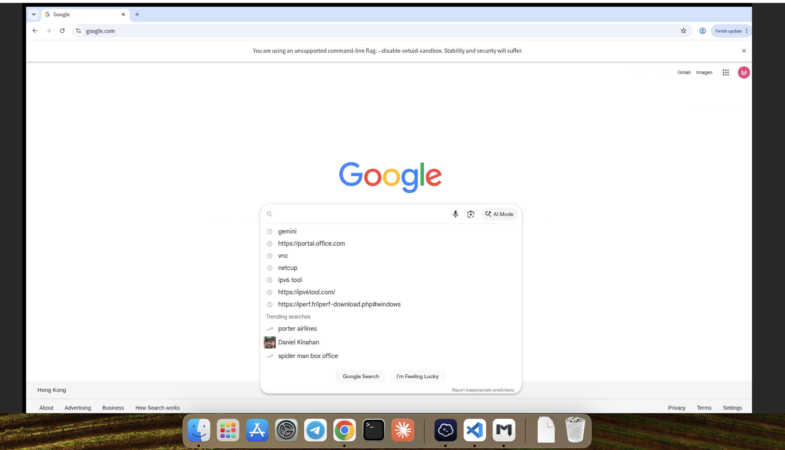

# Chrome MCP

[简体中文](README.zh-CN.md)

Chrome MCP is a local Model Context Protocol server for persistent, multi-profile Chrome automation. It lets an MCP client launch or reconnect to Chrome, keep login sessions across client restarts, manage tabs, inspect pages, interact with elements, evaluate JavaScript, and capture screenshots.

Chrome is started only when a browser lifecycle tool is called. Multiple MCP clients can connect to the same running Chrome process without creating duplicate browsers.



## Platform requirements

- Debian or Ubuntu on amd64
- systemd
- A non-root login with `sudo` access

The installer adds Google Chrome, Node.js 22 when the installed Node.js is too old, Xvfb, fonts, and the exact npm dependencies from `package-lock.json`.

## Install the runtime

```bash
git clone https://github.com/wzxklm/chrome-mcp.git
cd chrome-mcp
./setup-chrome-mcp.sh
```

Run the installer as the same non-root user that runs Codex or Claude Code. The script invokes `sudo` only for system packages and services. Chrome keeps its sandbox enabled by default and refuses to launch as root.

The installer deliberately does not edit any MCP client configuration.

## Add to Codex

From the cloned repository, run:

```bash
CHROME_MCP_DIR="$(pwd)"
codex mcp add chrome \
  --env CHROME_PATH=/usr/bin/google-chrome-stable \
  --env CHROME_DEFAULT_PROFILE_DIR="$HOME/.chrome-profile" \
  --env CHROME_PROFILES_DIR="$HOME/.chrome-profiles" \
  --env DISPLAY=:99 \
  -- node "$CHROME_MCP_DIR/src/server.js"
```

Verify the registration:

```bash
codex mcp list
```

Restart Codex after adding the server. In the Codex terminal UI, `/mcp` shows its connection and tools. Codex stores this user configuration in `~/.codex/config.toml`. See the [official Codex MCP documentation](https://developers.openai.com/codex/mcp/).

## Add to Claude Code

From the cloned repository, run:

```bash
CHROME_MCP_DIR="$(pwd)"
claude mcp add \
  --env CHROME_PATH=/usr/bin/google-chrome-stable \
  --env CHROME_DEFAULT_PROFILE_DIR="$HOME/.chrome-profile" \
  --env CHROME_PROFILES_DIR="$HOME/.chrome-profiles" \
  --env DISPLAY=:99 \
  --transport stdio \
  --scope user \
  chrome -- node "$CHROME_MCP_DIR/src/server.js"
```

Verify the registration:

```bash
claude mcp list
claude mcp get chrome
```

Use `/mcp` inside Claude Code to inspect the server. Replace `--scope user` with `--scope local` to keep the registration local to the current project. See the [official Claude Code MCP documentation](https://code.claude.com/docs/en/mcp).

## Ask the AI to use Chrome

After the server appears as connected in `/mcp`, describe the browser task to Codex or Claude Code in natural language. Mention `chrome MCP` when you specifically want this server rather than another browser integration. The AI receives Chrome MCP's built-in lifecycle instructions and decides whether to create, reconnect to, or reuse a browser profile before operating the page.

Examples:

```text
Use chrome MCP with the default browser profile. Open example.com, inspect the
page, and summarize the main content. Keep the browser running afterward.
```

```text
Use chrome MCP with a separate profile named research. Search for the official
documentation for this API and compare the current options in a table.
```

```text
Reconnect to the default chrome MCP profile and continue working in the tabs
that are already open. Do not close the browser when finished.
```

Browser profiles persist cookies and login sessions. For a site that needs authentication, ask the AI to open the login page in a named profile, complete any interactive login through the optional noVNC view, then ask the AI to continue. Say explicitly when the AI should close Chrome; leaving it unspecified allows the existing browser session to remain available for later tasks.

Deleting a browser profile permanently removes its browser data. Request profile deletion only when that is your explicit intent.

## Configuration

| Variable | Purpose | Default |
| --- | --- | --- |
| `CHROME_PATH` | Chrome executable | `/usr/bin/google-chrome-stable` |
| `CHROME_DEFAULT_PROFILE_DIR` | Directory for the profile named `default` | `$HOME/.chrome-profile` |
| `CHROME_PROFILES_DIR` | Parent directory for named profiles | `$HOME/.chrome-profiles` |
| `DISPLAY` | X display used by Chrome | `:99` |
| `CHROME_DISABLE_SANDBOX` | Explicitly disable Chrome's sandbox | `false` |

Profile paths must be absolute, must not overlap each other or this repository, and must not point to broad directories such as `/` or the user's home directory.

`CHROME_DISABLE_SANDBOX=true` is an escape hatch for a deliberately isolated container or an existing root-only deployment. It weakens Chrome's security boundary and should not be used on a general-purpose host.

## Optional noVNC access

To view display `:99` in a browser:

```bash
VNC_PASSWORD='choose-a-strong-password' ./setup-novnc.sh
```

x11vnc listens on `127.0.0.1:5900` and noVNC on `127.0.0.1:6080`. Keep both private. If remote access is required, put noVNC behind an authenticated HTTPS reverse proxy.

## Development and verification

```bash
npm ci
npm run check
```

`npm run check` validates JavaScript and shell syntax, runs the MCP contract and safety tests, and runs the full Chrome integration test when Chrome and display `:99` are available.

Repository layout:

```text
src/server.js          MCP server, browser lifecycle, and page tools
test/mcp.test.js       Contract, safety, concurrency, and browser tests
systemd/               Xvfb and optional noVNC services
setup-chrome-mcp.sh    Reproducible runtime installer
setup-novnc.sh         Optional local VNC installer
```

## Security

Browser profiles contain cookies, authenticated sessions, history, and other private data. Keep them outside this repository and never commit them. Review MCP tool calls before using Chrome MCP against sensitive accounts; page content can contain prompt injection.

## License

[MIT](LICENSE)
